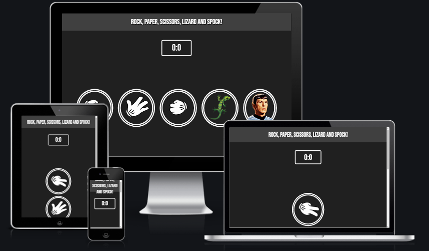

# RPSLS World
This project is a simple rock, paper, scissors, lizard and spock online game. This particular online game allows the user to play against the computer. My intended purpose for this game was to create a exciting and fun simple game without the need of a second player. 

My target audience would be for all ages. RPSLS World is a fully responsive JavaScript rock, paper, scissors, lizard and spock game that will allow users to have fun within 5 clicks.

## Features 

### Existing Features

- __The RPSLS World Heading__

  - Featured at the top of the page, the RPSLS World heading is easy to see for the user. Upon viewing the page, the user will be able to see the name of the game.

- __The Game Area__

  - This section will allow the user to play the RPSLS game. The user will be able to easily see icons for rock, paper, scissors, lizard and spock moves.
  - The user will be able to select the type of move they will play by clicking on the different icons. 

- __The Score Area__

  - This section will allow the user to see exactly what there score is playing aginst the computer.

### Features Left to Implement

- The ability to play with a friend.

## Testing 

### Validator Testing 

- HTML
    - No errors were returned when passing through the official [W3C validator](https://validator.w3.org/nu/#textarea)
- CSS
    - No errors were found when passing through the official [(Jigsaw) validator](https://jigsaw.w3.org/css-validator/validator)
- JavaScript
    - No errors were found when passing through the official [Jshint validator](https://jshint.com/)
      - The following metrics were returned: 
      - There are 10 functions in this file.
      - Function with the largest signature takes 2 arguments, while the median is 0.
      - Largest function has 14 statements in it, while the median is 1.
      - The most complex function has a cyclomatic complexity value of 3 while the median is 1.

## Deployment

- The site was deployed to GitHub pages. The steps to deploy are as follows: 
  - In the GitHub repository, navigate to the Settings tab 
  - From the source section drop-down menu, select the Master Branch
  - Once the master branch has been selected, the page will be automatically refreshed with a detailed ribbon display to indicate the successful deployment. 

The live link can be found here - https://seangrant18.github.io/Rock-Paper-Scissors-Lizard-Spock-Game/

### Media

- The photos used on the home and sign up page are from Google images